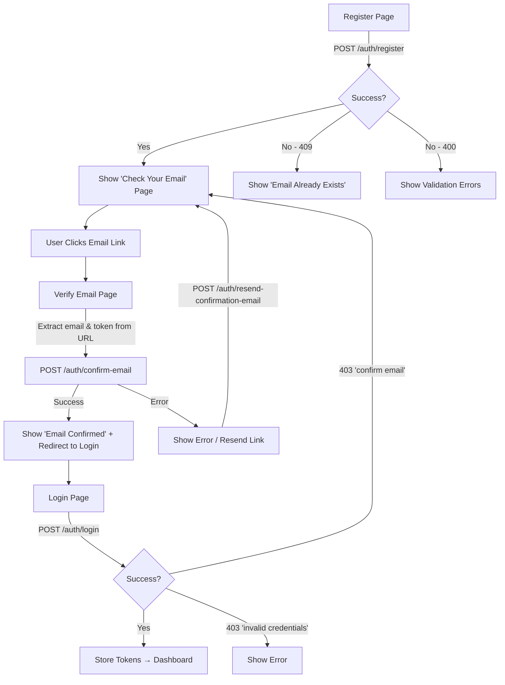
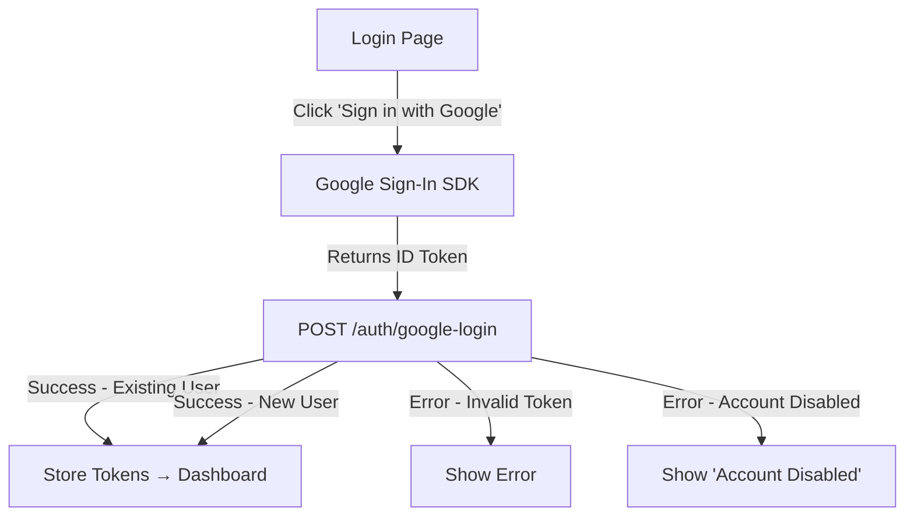
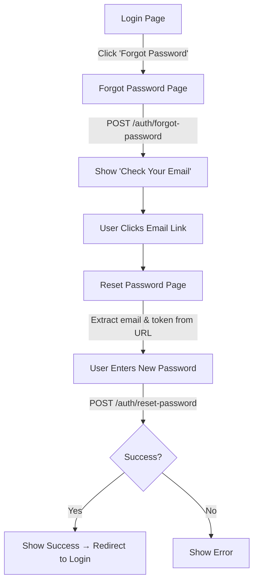
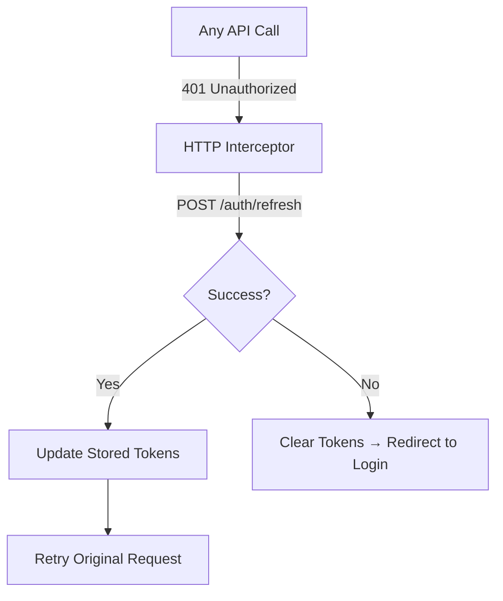

# Bosla Platform — API Reference for Frontend Implementation

> هذا الملف يحتوي على كل ما تحتاجه لتنفيذ الـ Frontend Angular — البنية الكاملة للـ API، الـ DTOs، الـ Validation، والـ Flows.

---

## 📋 Table of Contents

1. [API Configuration](#api-configuration)
2. [Response Wrapper Format](#response-wrapper-format)
3. [Error Handling Format](#error-handling-format)
4. [Authentication Endpoints](#authentication-endpoints)
5. [Request/Response DTOs (TypeScript)](#requestresponse-dtos-typescript)
6. [Validation Rules](#validation-rules)
7. [User Flows & Diagrams](#user-flows--diagrams)
8. [Google OAuth Setup](#google-oauth-setup)
9. [JWT Token Management](#jwt-token-management)
10. [UI Pages Required](#ui-pages-required)

---

## API Configuration

```
Base URL:        https://localhost:44397
API Version:     v1
API Prefix:      /api/v1
Auth Prefix:     /api/v1/auth
Content-Type:    application/json
Auth Header:     Authorization: Bearer {accessToken}
```

---

## Response Wrapper Format

**كل الـ API responses** مغلفة في هذا الشكل:

### ✅ Success Response

```json
{
  "success": true,
  "message": "Request completed successfully",
  "data": { ... },
  "errors": null,
  "pagination": null
}
```

### ❌ Error Response (Validation — 400)

```json
{
  "type": "https://tools.ietf.org/html/rfc9110#section-15.5.1",
  "title": "One or more validation errors occurred.",
  "status": 400,
  "errors": {
    "Email": ["The Email field is required."],
    "Password": ["Password must contain at least 8 characters..."]
  }
}
```

### ❌ Error Response (Non-Validation — 401/403/404/409/500)

```json
{
  "type": "https://tools.ietf.org/html/rfc9110#section-15.5.4",
  "title": "Invalid email or password.",
  "status": 403
}
```

### Error Status Code Mapping

| ErrorKind      | HTTP Status |
|---------------|-------------|
| `Validation`   | 400 Bad Request |
| `Unauthorized` | 403 Forbidden |
| `Forbidden`    | 403 Forbidden |
| `NotFound`     | 404 Not Found |
| `Conflict`     | 409 Conflict |
| `Unexpected`   | 500 Internal Server Error |

---

## Authentication Endpoints

### 1. 🔐 Login

```
POST /api/v1/auth/login
```

| Field      | Type   | Required | Notes |
|-----------|--------|----------|-------|
| `email`    | string | ✅ | Valid email format |
| `password` | string | ✅ | Non-empty |

**Request:**
```json
{
  "email": "user@example.com",
  "password": "MyPassword123"
}
```

**Success Response (200):**
```json
{
  "success": true,
  "message": "Request completed successfully",
  "data": {
    "accessToken": "eyJhbGciOiJIUzI1NiIs...",
    "refreshToken": "abc123base64...",
    "expiresOnUtc": "2026-06-18T01:00:00Z"
  }
}
```

**Error Responses:**
| Status | Message |
|--------|---------|
| 400 | Validation errors (empty email/password) |
| 403 | `"Invalid email or password."` |
| 403 | `"Your account is disabled."` |
| 403 | `"Please confirm your email first."` |
| 403 | `"Your account is locked."` |

---

### 2. 📝 Register

```
POST /api/v1/auth/register
```

| Field              | Type   | Required | Validation |
|-------------------|--------|----------|------------|
| `name`             | string | ✅ | MaxLength(100) |
| `email`            | string | ✅ | Valid email |
| `password`         | string | ✅ | Min 8 chars, 1 uppercase, 1 lowercase, 1 digit |
| `phoneNumber`      | string | ✅ | Valid phone |
| `preferredLanguage`| string | ❌ | MaxLength(12) |
| `gender`           | string | ❌ | nullable |
| `country`          | string | ✅ | |
| `role`             | string | ✅ | `"user"` or `"specialist"` only |

**Request:**
```json
{
  "name": "Ahmed Mohamed",
  "email": "ahmed@example.com",
  "password": "MyPassword123",
  "phoneNumber": "+201234567890",
  "preferredLanguage": "ar",
  "gender": "male",
  "country": "Egypt",
  "role": "user"
}
```

**Success Response (200):**
```json
{
  "success": true,
  "message": "Registration successful. Please check your email to confirm your account.",
  "data": {
    "message": "Registration successful. Please check your email to confirm your account.",
    "email": "ahmed@example.com"
  }
}
```

> [!IMPORTANT]
> الـ Register **لا يرجع tokens**. المستخدم يجب أن يؤكد إيميله أولاً عبر الرابط المرسل.

**Error Responses:**
| Status | Message |
|--------|---------|
| 400 | Validation errors |
| 400 | `"Invalid role selection."` |
| 404 | `"Role '{role}' does not exist."` |
| 409 | `"Email already exists."` |

---

### 3. ✅ Confirm Email

```
POST /api/v1/auth/confirm-email
```

| Field   | Type   | Required |
|---------|--------|----------|
| `email` | string | ✅ |
| `token` | string | ✅ |

> يتم استخراج `email` و `token` من الـ query parameters في رابط التأكيد المرسل بالإيميل:
> `https://localhost:44397/verify-email?email={email}&token={token}`

**Request:**
```json
{
  "email": "ahmed@example.com",
  "token": "CfDJ8NzZ... (URL-encoded token from email link)"
}
```

**Success Response (200):**
```json
{
  "success": true,
  "message": "Email confirmed successfully.",
  "data": true
}
```

> [!NOTE]
> بعد التأكيد بنجاح، يتم إرسال **Welcome Email** تلقائياً للمستخدم عبر Domain Event.

**Error Responses:**
| Status | Message |
|--------|---------|
| 400 | `"Email is already confirmed."` |
| 400 | Invalid/expired token |
| 404 | `"Invalid confirmation request."` |

---

### 4. 📧 Resend Confirmation Email

```
POST /api/v1/auth/resend-confirmation-email
```

| Field   | Type   | Required |
|---------|--------|----------|
| `email` | string | ✅ |

**Request:**
```json
{
  "email": "ahmed@example.com"
}
```

**Success Response (200):**
```json
{
  "success": true,
  "message": "If an account exists, a confirmation email has been sent.",
  "data": true
}
```

> [!NOTE]
> يرجع **نجاح دائماً** حتى لو الإيميل غير موجود (لمنع email enumeration).

**Error Responses:**
| Status | Message |
|--------|---------|
| 400 | `"Email is already confirmed."` |

---

### 5. 🔵 Google Login

```
POST /api/v1/auth/google-login
```

| Field     | Type   | Required |
|-----------|--------|----------|
| `idToken` | string | ✅ |

> الـ `idToken` يتم الحصول عليه من Google Sign-In SDK في الـ Frontend.

**Request:**
```json
{
  "idToken": "eyJhbGciOiJSUzI1NiIs... (Google ID Token)"
}
```

**Success Response (200):**
```json
{
  "success": true,
  "message": "Google login successful.",
  "data": {
    "accessToken": "eyJhbGciOiJIUzI1NiIs...",
    "refreshToken": "abc123base64...",
    "expiresOnUtc": "2026-06-18T01:00:00Z"
  }
}
```

> [!IMPORTANT]
> - إذا المستخدم **جديد**: يتم إنشاء حساب تلقائياً بدور `"user"` + يتم تأكيد الإيميل تلقائياً + يتم إرسال Welcome Email
> - إذا المستخدم **موجود**: يتم تسجيل الدخول مباشرة + ربط Google Login إن لم يكن مربوط

**Error Responses:**
| Status | Message |
|--------|---------|
| 403 | `"Invalid Google token."` |
| 403 | `"Your account is disabled."` |

---

### 6. 🔄 Refresh Token

```
POST /api/v1/auth/refresh
```

| Field          | Type   | Required |
|---------------|--------|----------|
| `accessToken`  | string | ✅ |
| `refreshToken` | string | ✅ |

**Request:**
```json
{
  "accessToken": "eyJhbGciOiJIUzI1NiIs... (expired JWT)",
  "refreshToken": "abc123base64..."
}
```

**Success Response (200):**
```json
{
  "success": true,
  "message": "Request completed successfully",
  "data": {
    "accessToken": "eyJhbGciOiJIUzI1NiIs... (new JWT)",
    "refreshToken": "xyz789base64... (new refresh token)",
    "expiresOnUtc": "2026-06-18T02:00:00Z"
  }
}
```

---

### 7. 🚪 Logout

```
POST /api/v1/auth/logout
Authorization: Bearer {accessToken}
```

> ⚠️ يتطلب `Authorization` header — endpoint محمي

**Success Response (200):**
```json
{
  "success": true,
  "message": "Logged out successfully.",
  "data": true
}
```

---

### 8. 🔑 Forgot Password

```
POST /api/v1/auth/forgot-password
```

| Field   | Type   | Required |
|---------|--------|----------|
| `email` | string | ✅ |

**Request:**
```json
{
  "email": "ahmed@example.com"
}
```

**Success Response (200):**
```json
{
  "success": true,
  "message": "If an account exists, a reset token has been sent.",
  "data": true
}
```

> الرابط المرسل: `https://localhost:44397/reset-password?email={email}&token={token}`

---

### 9. 🔒 Reset Password

```
POST /api/v1/auth/reset-password
```

| Field         | Type   | Required | Validation |
|--------------|--------|----------|------------|
| `email`       | string | ✅ | Valid email |
| `token`       | string | ✅ | From email link |
| `newPassword` | string | ✅ | Min 8 chars |

**Request:**
```json
{
  "email": "ahmed@example.com",
  "token": "CfDJ8NzZ... (from email link)",
  "newPassword": "NewSecurePassword123"
}
```

**Success Response (200):**
```json
{
  "success": true,
  "message": "Password reset successfully.",
  "data": true
}
```

---

## Request/Response DTOs (TypeScript)

```typescript
// ===== REQUESTS =====

interface LoginRequest {
  email: string;
  password: string;
}

interface RegisterRequest {
  name: string;
  email: string;
  password: string;
  phoneNumber: string;
  preferredLanguage?: string;
  gender?: string;
  country: string;
  role: 'user' | 'specialist';
}

interface ConfirmEmailRequest {
  email: string;
  token: string;
}

interface ResendConfirmationEmailRequest {
  email: string;
}

interface GoogleLoginRequest {
  idToken: string;
}

interface RefreshTokenRequest {
  accessToken: string;
  refreshToken: string;
}

interface ForgotPasswordRequest {
  email: string;
}

interface ResetPasswordRequest {
  email: string;
  token: string;
  newPassword: string;
}

// ===== RESPONSES =====

interface ApiResponse<T> {
  success: boolean;
  message: string;
  data: T | null;
  errors: Error[] | null;
  pagination: PaginationMetadata | null;
}

interface TokenResponse {
  accessToken: string;
  refreshToken: string;
  expiresOnUtc: string; // ISO 8601 datetime
}

interface RegisterResponse {
  message: string;
  email: string;
}

// ===== ERRORS =====

interface ProblemDetails {
  type: string;
  title: string;
  status: number;
  errors?: Record<string, string[]>; // validation errors only
}
```

---

## Validation Rules

| Endpoint | Field | Rules |
|----------|-------|-------|
| Login | `email` | Required, valid email |
| Login | `password` | Required |
| Register | `name` | Required, max 100 chars |
| Register | `email` | Required, valid email |
| Register | `password` | Required, min 8 chars, 1 uppercase, 1 lowercase, 1 digit |
| Register | `phoneNumber` | Required, valid phone |
| Register | `role` | Required, must be `"user"` or `"specialist"` |
| Register | `country` | Required |
| Confirm Email | `email` | Required, valid email |
| Confirm Email | `token` | Required |
| Resend Confirmation | `email` | Required, valid email |
| Google Login | `idToken` | Required |
| Refresh | `accessToken` | Required |
| Refresh | `refreshToken` | Required |
| Forgot Password | `email` | Required, valid email |
| Reset Password | `email` | Required, valid email |
| Reset Password | `token` | Required |
| Reset Password | `newPassword` | Required, min 8 chars |

---

## User Flows & Diagrams

### Flow 1: Registration → Email Verification → Login



### Flow 2: Google Login



### Flow 3: Forgot Password → Reset



### Flow 4: Token Refresh (Interceptor)



---

## Google OAuth Setup

### Google Client Credentials

```
Client ID:     818109149867-jlbj83dcs95rknac2g38asnefamefj5o.apps.googleusercontent.com
Client Secret: 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
```

### Angular Implementation Notes

1. Install Google Sign-In SDK أو use `@abacritt/angularx-social-login`
2. Configure with the Client ID above
3. On successful Google sign-in, extract the `idToken` (also called `credential`)
4. Send the `idToken` to `POST /api/v1/auth/google-login`
5. The backend validates the token server-side with Google

---

## JWT Token Management

### Token Details

| Property | Value |
|----------|-------|
| Algorithm | HMAC SHA-256 |
| Access Token Expiry | 60 minutes |
| Refresh Token Expiry | 7 days |
| Issuer | `localhost` |
| Audience | `localhost` |

### JWT Claims (decoded)

```json
{
  "sub": "user-guid",
  "http://schemas.xmlsoap.org/ws/2005/05/identity/claims/nameidentifier": "user-guid",
  "email": "user@example.com",
  "jti": "unique-token-id",
  "http://schemas.microsoft.com/ws/2008/06/identity/claims/role": "user",
  "exp": 1718758800,
  "iss": "localhost",
  "aud": "localhost"
}
```

### Storage Strategy (recommended)

- **Access Token**: `localStorage` or in-memory (HttpOnly cookie is more secure)
- **Refresh Token**: `localStorage`
- On 401 → use refresh token to get new pair
- On refresh failure → clear all → redirect to login

---

## UI Pages Required

| # | Page | Route | Description |
|---|------|-------|-------------|
| 1 | **Login** | `/login` | Email + Password + Google Login button |
| 2 | **Register** | `/register` | Full registration form |
| 3 | **Verify Email** | `/verify-email` | Receives `?email=&token=` → auto-confirms |
| 4 | **Check Email** | `/check-email` | "Please check your email" message + resend button |
| 5 | **Forgot Password** | `/forgot-password` | Email input only |
| 6 | **Reset Password** | `/reset-password` | Receives `?email=&token=` → new password form |
| 7 | **Email Confirmed** | (can be part of verify-email) | Success message + login redirect |

### Assets Available

The following images were generated for the Bosla platform and can be used in the frontend:

| Asset | Usage | Colors |
|-------|-------|--------|
| Hero Background (Compass Mountains) | Hero/Header video background | Terracotta, Gold, Charcoal |
| Hero Background (Desert Network) | Hero/Header video background | Terracotta, Gold, Charcoal |
| Hero Background (Holographic Compass) | Hero/Header video background | Navy Blue, Teal, Purple |
| Auth Background (Warm Bokeh) | Login/Register card background video | Terracotta, Beige, Brown |

### Color Palette (from website)

```css
:root {
  --color-terracotta:    #C4663A;
  --color-terracotta-dark: #B5543A;
  --color-sandy-beige:   #F5E6D0;
  --color-cream:         #FDF8F3;
  --color-charcoal:      #2C2C2C;
  --color-warm-brown:    #3D2B1F;
  --color-primary:       #4361EE; /* Used in email templates */
  --color-white:         #FFFFFF;
}
```

---

## Endpoints Summary Table

| # | Method | Endpoint | Auth | Request Body | Response Data |
|---|--------|----------|------|--------------|---------------|
| 1 | POST | `/api/v1/auth/login` | ❌ | `LoginRequest` | `TokenResponse` |
| 2 | POST | `/api/v1/auth/register` | ❌ | `RegisterRequest` | `RegisterResponse` |
| 3 | POST | `/api/v1/auth/confirm-email` | ❌ | `ConfirmEmailRequest` | `bool` |
| 4 | POST | `/api/v1/auth/resend-confirmation-email` | ❌ | `ResendConfirmationEmailRequest` | `bool` |
| 5 | POST | `/api/v1/auth/google-login` | ❌ | `GoogleLoginRequest` | `TokenResponse` |
| 6 | POST | `/api/v1/auth/refresh` | ❌ | `RefreshTokenRequest` | `TokenResponse` |
| 7 | POST | `/api/v1/auth/logout` | ✅ | — | `bool` |
| 8 | POST | `/api/v1/auth/forgot-password` | ❌ | `ForgotPasswordRequest` | `bool` |
| 9 | POST | `/api/v1/auth/reset-password` | ❌ | `ResetPasswordRequest` | `bool` |
